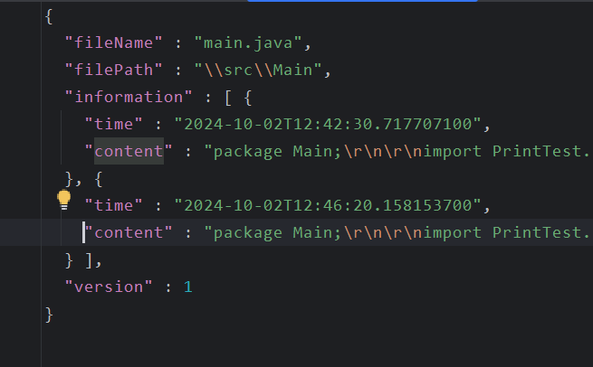

# 项目介绍  
## 概述  
本项目致力于开发一个IntellijIDEA的插件，用于进行代码历史版本的查询。  
## 环境搭建  
[环境搭建视频链接](https://www.bilibili.com/video/BV1TZ421u7dX/?spm_id_from=333.999.0.0&vd_source=88e663d19e01010708eb05f374a42f9c)  
[环境搭建文档链接](https://github.com/yangfeng20/idea-plugin-dev-guide/)  
提醒：在本地搭建环境时，可能要修改build.gradle.kts中的目标IDEA版本为自己本地IDEA的路径，参考上面的视频或文档资料。  
## 功能要点  
### 自动储存文件内容  
在项目打开和文件修改时，插件将自动储存项目中的文件内容，以字符串的形式储存在json文件中，如果已经有对应的json文件，将在后边新添加一个版本。  
### 可视化查询历史内容  
在toolmenu栏（暂定）中，增加一个查询历史内容的功能，打开后可以将储存的json数据转换为一个图形化界面，暂定为：左侧为文件目录，在每个文件下再加上不同的版本选择，点击后右侧显示相应内容。  
### git分支记录细粒化修改  
再添加一个进行git分支的按钮，创建的新分支会将细粒化的修改作为每一次提交，然后在适当的时间合并回原分支，保证原分支提交的整洁。  
## 开发要点  
+ 将项目中的文件数据保存在一个文件夹中，设计储存的json数据结构。  
+ 细粒度修改保存的策略（暂定为保存操作），版本保存和git分支合并的策略（暂定为一定时间间隔）。  
+ 版本查询可视化界面的设计，将储存版本内容的文件夹转化为UI界面，且实现查看功能。
+ git提交、合并操作在代码中的实现。  
## 要点详解  
### 查询界面设计  
查询界面要求在点击一个按钮触发action后出现。界面分为两个部分，左边为历史版本，右边为显示代码的文本框（可以同时显示当前内容和历史版本内容）。  
版本通过CodeHistory文件夹下的json数据转换，通过获取当前文件，指向一个json文件，将其中的information元素对应的不同版本显示在左侧。  
当点击不同版本时，右侧将显示information元素中对应版本的content数据，以及当前文件的现有内容，形成对比。
界面设计可以参考IDEA自带的历史查询功能localhistory（搜索框中搜索localhistory使用）。  
json的数据结构可以自己运行已有代码查看，下面是示例截图：  
  
### git相关接口调研  
git相关操作对应作业文档中的F2内容，要求在点击一个按钮触发action后，生成一个新分支（如果已有就不生成），用于记录更加细粒化的修改提交，然后在积累一定量的提交后，作为一次提交合并到主分支。  
调研内容主要为在代码端实现创建git仓库、生成git分支、切换分支、合并分支等操作。  
主要问题在于，如何让一个分支的多次提交在合并回原分支时，作为一次提交（常规git分支合并会将所有提交转移到原分支，提交记录仍为多次），来保证原分支提交的整洁性。  
## 文件功能简介  
### localhistory  
CodeHistoryStart:项目打开时的初始化操作。  
ComponentsInit:插件组件的初始化操作。  
FileEventListener:文件监听器，监听文件的修改、创建、移动。  
HistoryQueryAction:设置一个HistoryQuery按钮，用于打开历史版本查询界面的按钮（未完成）。
### structure  
用于储存自定义的数据结构。  
### util  
FileManager:储存与文件相关的函数，比如计算一个文件的相对路径。  
FileToJson:储存与文件转化为json数据的相关函数，比如转化单个文件、由文件路径获取对应json路径等功能。  
ProjectManager:储存与项目相关的函数，比如获取当前项目。  
StringProcess:储存处理字符串的函数。
### 其他
plugin.xml:插件注册文件。  
build.gradle.kts:gradle开发环境配置文件。